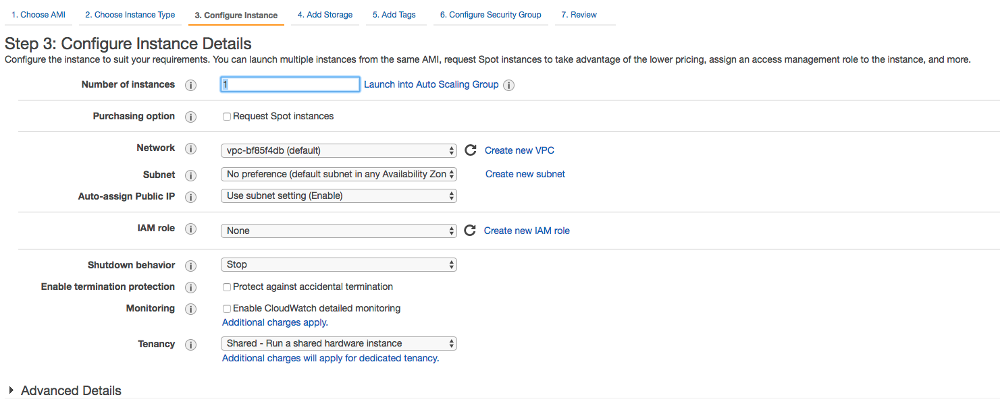
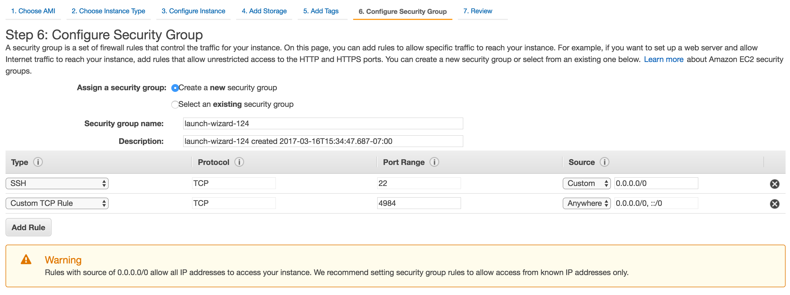
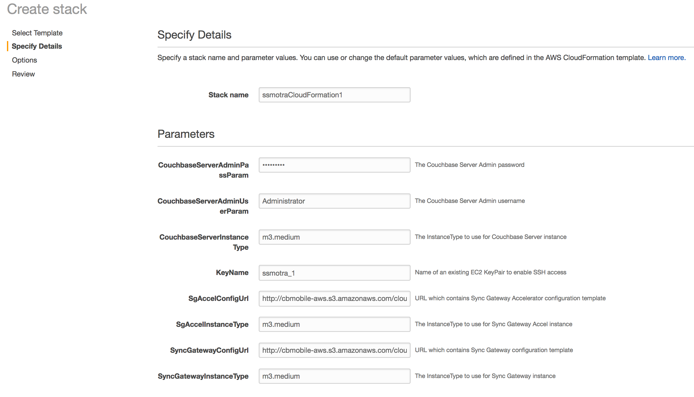

Running the Couchbase Mobile Sync Gateway / Sync Gateway Accelerator AMI

## AMI Overview

Choose which AMI to launch:

1. Sync Gateway 1.4 Enterprise Edition
1. Sync Gateway 1.4 Community Edition
1. Sync Gateway Accelerator 1.4 Enterprise Edition

## Launch Sync Gateway EC2 Instance with an in-memory backing store

* Follow this link: [Sync Gateway 1.4 Enterprise Edition](https://console.aws.amazon.com/ec2/v2/home?region=us-east-1#LaunchInstanceWizard:ami=ami-b76bc5a1)  (NOTE: this will be a button in the AWS marketplace after it's submitted)
* Choose the appropriate size (recommended: m3.medium)
* Configure instance details 
* Increase storage size if needed
* Tags: it's recommended to add a tag with a key of "Name" a value of "Sync Gateway", for your own tracking purposes
* Edit your Security Group to expose port 4984 to Anywhere
   * Add rule
   * Type: leave as custom tcp rule
   * Under port range enter 4984
   * Under Source choose Click: Custom pulldown and choose Anywhere
   

* Launch instance

### Verify

* In the AWS Management Console web UI, go to the **EC2** section and look for an instance named `syncgateway`, and click it to show the instance details
* Find the public dns name of the instance from the **Public DNS (IPv4)** field: it should look something like **ec2-54-152-154-24.compute-1.amazonaws.com**
* In your browser, go to port 4984 **http://public-dns-name-of-instance:4984** and it should return JSON content like `{couchdb: "Welcome", ..etc ..`

### Customize Sync Gateway configuration

If you need to customize the Sync Gateway configuration, find the hostname of the Sync Gateway EC2 instance and:

```
$ ssh ec2-user@hostname
```

Update the configuration:

```
$ sudo bash
$ vi /opt/sync_gateway/etc/sync_gateway.json
```

Restart the Sync Gateway service:

```
$ service sync_gateway restart
```

## Launch CloudFormation with: Sync Gateways + Sync Gateway Accelerators + Couchbase Servers

To launch a full mobile backend Cloudformation stack click the **Launch Stack** button below:

[](https://console.aws.amazon.com/cloudformation/home?region=us-east-1#/stacks/new?stackName=CouchbaseSyncGateway&templateURL=http://cbmobile-aws.s3.amazonaws.com/cloudformation-templates/SyncGateway1.4.0/generated_cloudformation_template.json)

You will need to customize:

1. The Couchbase Server Admin password -- please use something that is hard to guess
1. The SSH key name which allows you to SSH into any of the instances.  If you don't already have one registered in EC2, you will need to add one.



This will create the following AutoScalingGroups:

- Couchbase Server Enterprise Edition 4.5.0
- Sync Gateway 1.4 Enterprise Edition
- Sync Gateway Accel 1.4 Enterprise Edition

**Caveat:** currently this depends on an external REST API to bootstrap the discovery of the Couchbase Server.  [tracking ticket](https://github.com/couchbase/sync_gateway/issues/2386)

### Verify

* In the AWS Management Console web UI, go to the **EC2** section and look for the **Load Balancing / Load Balancer** section on the left hand navigation
* Click the Load Balancer and look for the **DNS Name** field, it should be something like `SGAS-YOUR_STACK_NAME_Stack-576263650.us-east-1.elb.amazonaws.com`
* In your browser, go to port 4984 **http://SGAS-YOUR_STACK_NAME_Stack-576263650.us-east-1.elb.amazonaws.com:4984** and it should return JSON content like `{couchdb: "Welcome", ..etc ..`

### Increase Capacity

All resources are in AutoScalingGroups and it is simple to scale capacity up or down.

* In the AWS / EC2 Web Admin UI, find the AutoScalingGroup of the resource you want to increase capacity for (Couchbase Server, Sync Gateway, etc) and changed the number of **Desired** instances.

### Customize configuration

1. Download these two files:

    * [sync_gateway.json.template](http://cbmobile-aws.s3.amazonaws.com/cloudformation-sync-gateway-config/SyncGateway1.4.0/sync_gateway.json.template)
    * [sg_accel.json.template](http://cbmobile-aws.s3.amazonaws.com/cloudformation-sync-gateway-config/SyncGateway1.4.0/sg_accel.json.template)

1. Customize the configuration templates to your liking
1. Upload them to publicly accessible URL's
1. Launch a new Cloudformation Stack, and replace the configuration URL's to point to your customized configuration files

**Caveat** If you need to add more buckets, or want to rename the buckets, you will need to do that by hand.  Please file an issue if you run into this limitation.

### Connect to Couchbase Web Admin

By default, the Couchbase Web Admin port 8091 is not accessible.

**Allow restricted access to port 8091**

1. In the AWS EC2 Web Console **Auto Scaling Groups** section, look for an Auto Scaling Group with "<cloudformation-name>-CBServerAutoScalingGroup" somewhere in the name
1. Click the **Instances** tab, and you should see one instance listed
1. Click any one of the **Instance IDs** listed, and it will take you to the details for that instance.
1. Under **Security Groups**, click the security group
1. Choose the **Inbound** tab
1. Click the **Edit** button
1. Add a new rule with
       * **Type** Custom TCP Rule
       * **Protocol** TCP
       * **Port Range** 8091
       * **Source** Choose **Custom** pulldown and choose My IP

**Login to Couchbase Server**

1. In the AWS Management Console web UI, find a Couchbase Server instance from the CouchbaseServer AutoScalingGroup you just launched, and click it to show the instance details
1. Find the public dns name of the instance from the **Public DNS (IPv4)** field: it should look something like **ec2-54-152-154-24.compute-1.amazonaws.com**
1. In your browser, go to port 4984 **http://public-dns-name-of-instance:8091** and it should show a login screen.  Use the Username/Password combo that you used when launching the Cloudformation.


